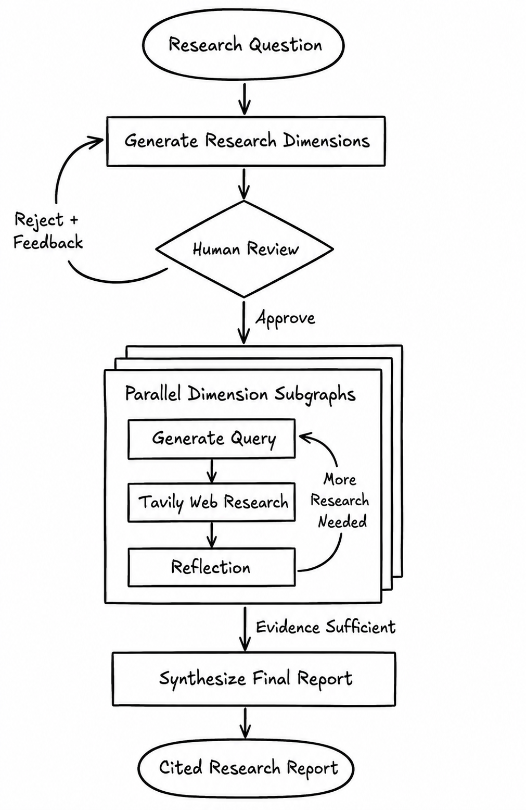

# DeepSeek + Tavily Fullstack LangGraph Research Agent

This project demonstrates a fullstack research application with a React
frontend and a LangGraph-powered backend. It generates a research plan, searches
the web, reflects on knowledge gaps, iterates when more evidence is needed, and
produces a cited research report.

This repository was forked from Google's
[Gemini Fullstack LangGraph Quickstart](https://github.com/google-gemini/gemini-fullstack-langgraph-quickstart).
The original React, FastAPI, and LangGraph fullstack foundation is retained,
while the model provider, search backend, graph topology, human review flow,
streaming behavior, and frontend session experience have been substantially
redesigned.

## What Changed from the Upstream Project

The upstream quickstart uses Gemini and Google Search in a mostly linear
research loop. This fork introduces the following changes:

| Area | Upstream | This fork |
| --- | --- | --- |
| LLM backend | Google Gemini | DeepSeek through its OpenAI-compatible API |
| Web search | Google Search | Tavily Search |
| Research planning | Generate queries directly from the question | Decompose the question into multiple complementary research dimensions |
| Human control | No approval gate | Human-in-the-loop approval and feedback before research starts |
| Execution model | One research loop | One isolated subgraph per dimension, executed in parallel |
| Reflection | Reflect on the overall search result | Reflect independently per dimension and return knowledge gaps to query generation |
| Reliability | Search errors terminate the run | Tavily retries and individual-query failure degradation |
| Progress UI | Top-level graph progress | Nested subgraph progress forwarded as custom stream events |
| Result isolation | Shared accumulated state | Per-run IDs isolate sources and dimension results |
| Browser continuity | In-memory frontend session | LangGraph thread ID persisted for page-reload recovery |

Additional frontend improvements include a dimension review dialog, readable
dark-theme approval controls, an auto-scrolling activity timeline, configurable
API URL, explicit loading and error states, and safe wrapping for long report
content.

## Current Workflow

The backend graph is defined in
[`backend/src/research_agent/graph.py`](backend/src/research_agent/graph.py).

<p align="center">
  
</p>

### Parent graph

1. **Generate research dimensions.** DeepSeek decomposes the question into
   distinct, complementary, independently researchable dimensions.
2. **Human review.** LangGraph pauses with `interrupt()` and displays the
   proposed dimensions in the frontend.
3. **Approve or revise.** Approval starts research. Rejection requires feedback;
   the previous proposal and feedback are sent back to dimension generation.
   This loop continues until the user approves the plan.
4. **Parallel dimension research.** The parent graph dispatches one isolated
   subgraph for every approved dimension.
5. **Synthesize the report.** Completed dimension results are filtered to the
   current research run, merged, and converted into a cited final report.

### Dimension subgraph

Every dimension runs the same independent loop:

1. **Generate query.** Produce focused Tavily queries for the dimension and its
   latest knowledge gap.
2. **Web research.** Execute queries in parallel, normalize sources, assign
   stable source IDs, and retry transient Tavily failures.
3. **Reflection.** Evaluate whether the evidence is sufficient for that
   dimension.
4. **Refine.** If evidence is insufficient and the loop budget remains, pass the
   knowledge gap back to query generation. Otherwise return the dimension result
   to the parent graph.

Custom events from nested subgraphs are forwarded to the parent stream so the
frontend can display query generation, searches, retries, reflections, and
dimension completion in real time.

## Features

- Fullstack React, FastAPI, and LangGraph application.
- DeepSeek models for dimension planning, query generation, reflection, and
  final synthesis.
- Tavily Search with configurable depth, result limits, retries, and partial
  failure handling.
- Human-in-the-loop research-plan approval with iterative feedback.
- Parallel research across independently isolated dimensions.
- Reflection-driven follow-up queries within each dimension.
- Stable source markers and validated Markdown citations.
- Live nested-subgraph activity in the frontend.
- Persistent LangGraph thread recovery after a browser reload.
- Hot reloading for frontend and backend development.

## Project Structure

- `frontend/` — React application built with Vite, Tailwind CSS, and shadcn/ui.
- `backend/` — LangGraph and FastAPI application containing the research agent.
- `backend/src/research_agent/graph.py` — parent graph and dimension subgraph.
- `backend/src/research_agent/prompts.py` — prompts for planning, querying,
  reflection, and synthesis.
- `backend/src/research_agent/state.py` — typed graph state and reducers.

## Getting Started

### Prerequisites

- Node.js and npm
- Python 3.11+
- [`uv`](https://docs.astral.sh/uv/)
- A `DEEPSEEK_API_KEY`
- A `TAVILY_API_KEY`

### Configure the backend

```bash
cd backend
cp .env.example .env
```

Set the required keys in `backend/.env`:

```dotenv
DEEPSEEK_API_KEY="YOUR_DEEPSEEK_API_KEY"
TAVILY_API_KEY="YOUR_TAVILY_API_KEY"
```

Optional backend configuration:

| Variable | Default | Purpose |
| --- | --- | --- |
| `DEEPSEEK_BASE_URL` | `https://api.deepseek.com` | DeepSeek-compatible API endpoint |
| `QUERY_GENERATOR_MODEL` | `deepseek-v4-flash` | Dimension planning and query generation |
| `REFLECTION_MODEL` | `deepseek-v4-flash` | Per-dimension reflection |
| `ANSWER_MODEL` | `deepseek-v4-pro` | Final report synthesis |
| `NUMBER_OF_RESEARCH_DIMENSIONS` | `3` | Number of dimensions, from 2 to 8 |
| `TAVILY_SEARCH_DEPTH` | `advanced` | Tavily search depth |
| `TAVILY_MAX_RESULTS` | `5` | Maximum results per query |
| `TAVILY_MAX_RETRIES` | `2` | Retries after the first search attempt |

### Install dependencies

Backend:

```bash
cd backend
uv sync --group dev
```

Frontend:

```bash
cd frontend
npm install
```

### Run locally

From the repository root:

```bash
make dev
```

Open `http://localhost:5173/app/`.

To run the services separately:

```bash
# Backend
cd backend
PYTHONPATH=src langgraph dev

# Frontend, in another terminal
cd frontend
npm run dev
```

The frontend connects to `http://localhost:2024` during development. Set
`VITE_LANGGRAPH_API_URL` when the LangGraph API runs on another origin.

> The web application is the recommended entry point because it implements the
> human-in-the-loop dimension approval and resume flow.

## Development Notes

- The Python distribution is named `deepseek-tavily-research-agent`, and the
  source package is `research_agent` to avoid collisions with globally installed
  packages named `agent`.
- `PYTHONPATH=src` allows a globally installed LangGraph CLI to load the
  src-layout package reliably.
- The frontend stores the active LangGraph thread ID in browser local storage so
  a page reload can restore the persisted thread history.
- Development defaults to `http://localhost:2024`; production defaults to the
  page origin unless `VITE_LANGGRAPH_API_URL` is provided.

## Deployment

In production, the backend serves the optimized frontend build. A LangGraph
deployment uses Redis for streaming and background-run coordination and
Postgres for threads, checkpoints, runs, and durable state.

Build the Docker image from the repository root:

```bash
docker build -t deepseek-tavily-fullstack-langgraph -f Dockerfile .
```

Run the production stack:

```bash
DEEPSEEK_API_KEY=<your_deepseek_api_key> \
TAVILY_API_KEY=<your_tavily_api_key> \
LANGSMITH_API_KEY=<your_langsmith_api_key> \
docker-compose up
```

Open `http://localhost:8123/app/`. The API is available at
`http://localhost:8123`.

## Technology Stack

- [React](https://react.dev/) and [Vite](https://vite.dev/)
- [Tailwind CSS](https://tailwindcss.com/) and
  [shadcn/ui](https://ui.shadcn.com/)
- [LangGraph](https://github.com/langchain-ai/langgraph)
- [DeepSeek](https://api-docs.deepseek.com/)
- [Tavily](https://docs.tavily.com/)

## Upstream and License

This work is derived from
[google-gemini/gemini-fullstack-langgraph-quickstart](https://github.com/google-gemini/gemini-fullstack-langgraph-quickstart).
Thanks to the upstream maintainers for the original fullstack quickstart and
workflow illustration style.

This project remains licensed under the Apache License 2.0. See
[`LICENSE`](LICENSE) for details.
