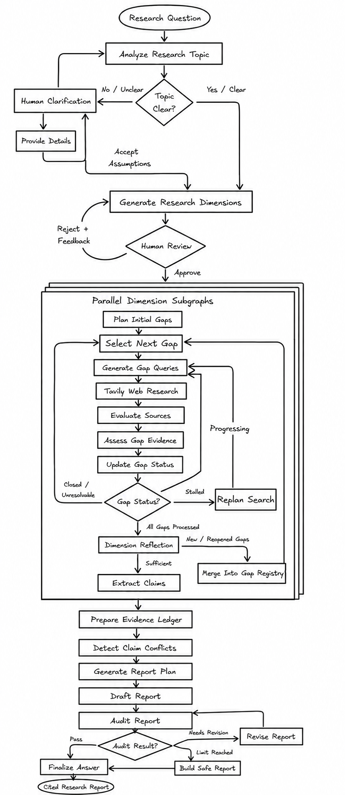

# DeepSeek + Tavily Fullstack LangGraph Research Agent

This project demonstrates a fullstack research application with a React
frontend and a LangGraph-powered backend. It generates a research plan, searches
the web, reflects on knowledge gaps, iterates when more evidence is needed, and
produces a cited research report.

This repository was forked from Google's
[Gemini Fullstack LangGraph Quickstart](https://github.com/google-gemini/gemini-fullstack-langgraph-quickstart).
The original React, FastAPI, and LangGraph fullstack foundation is retained,
while the model provider, search backend, graph topology, human review flow,
streaming behavior, and frontend session experience have been substantially
redesigned.

## What Changed from the Upstream Project

The upstream quickstart uses Gemini and Google Search in a mostly linear
research loop. This fork introduces the following changes:

| Area | Upstream | This fork |
| --- | --- | --- |
| LLM backend | Google Gemini | DeepSeek through the native `langchain-deepseek` `ChatDeepSeek` integration |
| Web search | Google Search | Tavily Search |
| Research planning | Generate queries directly from the question | Clarify materially ambiguous topics, then decompose them into complementary research dimensions |
| Human control | No approval gate | Human-in-the-loop topic clarification plus dimension approval and feedback loops |
| Execution model | One research loop | One isolated subgraph per dimension, executed in parallel |
| Reflection | Reflect on the overall search result | Reflect independently per dimension and return knowledge gaps to query generation |
| Report composition | Draft directly from research output | Build a validated editorial plan, write connected sections with shared context, and audit article coherence |
| Reliability | Search errors terminate the run | Tavily retries and individual-query failure degradation |
| Progress UI | Top-level graph progress | Nested subgraph progress forwarded as custom stream events |
| Result isolation | Shared accumulated state | Per-run IDs isolate sources and dimension results |
| Browser continuity | In-memory frontend session | LangGraph thread ID persisted for page-reload recovery |

Additional frontend improvements include topic clarification and dimension
review dialogs, readable dark-theme controls, an auto-scrolling activity
timeline, configurable API URL, explicit loading and error states, and safe
wrapping for long report content.

## Current Workflow

The backend graph is defined in
[`backend/src/research_agent/graph.py`](backend/src/research_agent/graph.py).
The parent graph, gap-driven dimension subgraph, and report flow below reflect
the current implementation.

<p align="center">
  
</p>

### Parent graph

1. **Analyze the research topic.** DeepSeek checks whether missing context or
   material ambiguity could change the research plan or conclusions. Broad but
   otherwise usable requests continue without unnecessary questions.
2. **Clarify when necessary.** If the topic is unclear, LangGraph pauses with
   `interrupt()` and the frontend displays the ambiguities, prioritized
   questions, and suggested assumptions. The user can provide details and
   trigger another analysis pass, or explicitly accept the assumptions. This
   loop continues until the topic is clear enough to plan.
3. **Generate research dimensions.** DeepSeek uses the normalized research brief
   to create distinct, complementary, independently researchable dimensions.
4. **Human review.** LangGraph pauses again and displays the
   proposed dimensions in the frontend.
5. **Approve or revise.** Approval starts research. Rejection requires feedback;
   the previous proposal and feedback are sent back to dimension generation.
   This loop continues until the user approves the plan.
6. **Parallel dimension research.** The parent graph dispatches one isolated
   subgraph for every approved dimension.
7. **Prepare the report evidence ledger.** Before any report model runs, the
   graph creates a fail-closed, current-run-only ledger. Only explicitly
   accepted sources survive; every evidence quote is revalidated against its
   source, claims without valid supporting evidence are removed, and stable
   claim IDs are assigned. Rejected and supplementary source content cannot
   enter drafting, auditing, revision, fallback generation, or citation
   rendering.
8. **Detect claim conflicts.** DeepSeek compares the sanitized claims across
   dimensions and produces a validated conflict ledger. The graph distinguishes
   true contradictions from scope differences and temporal changes, and marks
   unresolved medium- or high-severity contradictions as material.
9. **Plan the report narrative.** DeepSeek builds a validated editorial plan
   containing the central thesis, narrative strategy, section order, claim
   allocation, transitions, conclusion direction, and a consolidated approach
   to limitations. Unknown dimensions and claim IDs are removed, while every
   audited claim and dimension is deterministically restored if omitted.
10. **Draft the report.** The sanitized claims and conflict ledger are
   synthesized according to the shared plan. Long reports retain bounded
   section generation, but every section receives the global thesis, its own
   argumentative role, and continuity context from the preceding section. A
   separate cross-dimension conclusion is generated before deterministic
   assembly.
11. **Audit and revise.** The normal report audit checks coverage, factual
    support, citations, uncertainty, counterarguments, thesis, paragraph
    development, transitions, repetition, and conclusion quality. Deterministic
    checks reject drafts dominated by enumerated claim fragments or repetitive
    evidence disclaimers unless the user explicitly requested a list. A separate
    consistency audit checks conflict disclosure and report-introduced
    contradictions. Deterministic checks independently require both sides'
    citations and the conflict ID, so a model cannot incorrectly pass a silent
    contradiction. Failed audits return to bounded revision.
12. **Use a safe fallback when needed.** If the audit still fails after the
    revision budget is exhausted, the graph builds citation-safe prose
    paragraphs, an overview, a conclusion, and explicit treatment of both sides
    of material unresolved conflicts from the sanitized claim ledger. An
    unaudited model draft is never published merely because the retry limit was
    reached.
13. **Finalize the answer.** The final node renders citations from report-ledger
    sources only and publishes either an audited report or the deterministic
    safe fallback.

### Dimension subgraph

Each dimension keeps an isolated evidence-gap registry and independently
verifiable lifecycle:

1. **Plan initial gaps.** Decompose the approved dimension into concrete,
   answerable evidence gaps with stable IDs, expected evidence, requested
   source types, and priorities, then store them in the gap registry.
2. **Select the next gap.** Choose one unresolved gap by priority and expected
   impact so a small query budget is not spread thinly across many gaps.
3. **Generate gap queries.** Produce focused Tavily queries for that gap, using
   its expected evidence, requested source types, and failed-query history.
4. **Web research.** Execute queries in parallel, normalize sources, assign
   stable source IDs, and retry transient Tavily failures.
5. **Evaluate sources.** Deduplicate and score candidate evidence for relevance,
   authority, recency, primary-source status, and domain diversity. Weak or
   redundant sources are rejected before reflection.
6. **Assess gap evidence.** Verify that newly accepted evidence directly answers
   the active gap, contributes novel supported claims, satisfies the requested
   source type, and is independent of existing evidence.
7. **Update gap status.** Apply deterministic closure rules and record attempts,
   evidence coverage, unresolved conflicts, and no-progress counts.
8. **Route progress.** Continue focused queries while evidence is improving;
   invoke search replanning after a stall; or move to the next gap after the
   current gap is closed or explicitly classified as unresolvable.
9. **Dimension reflection.** After all known gaps have been processed, audit the
   complete dimension for omissions and contradictions. Only material,
   searchable high- or medium-priority gaps survive semantic deduplication and
   return to gap selection. Reflection uses a soft budget and extends toward a
   hard cap only while durable evidence or resolved-gap progress continues; two
   no-progress audits stop the dimension early.
10. **Extract and audit claims.** Once the dimension is sufficient or completes
   with explicit limitations, convert accepted evidence into a concise auditable
   claim set and reconcile it against the final Gap Registry. The result records
   a precise termination reason such as no progress, exhausted Gap attempts,
   unmet source quality, unresolved contradiction, or hard reflection limit;
   reports translate those internal states into readable limitation statements.

Custom events from nested subgraphs are forwarded to the parent stream so the
frontend can display query generation, searches, retries, reflections, and
dimension completion in real time.

## Features

- Fullstack React, FastAPI, and LangGraph application.
- DeepSeek models for dimension planning, query generation, reflection, and
  final synthesis.
- Tavily Search with configurable depth, result limits, retries, and partial
  failure handling.
- Material-ambiguity detection with iterative human clarification and optional
  acceptance of suggested assumptions.
- Human-in-the-loop research-plan approval with iterative feedback.
- Parallel research across independently isolated dimensions.
- Gap-driven follow-up queries with deterministic closure and stall detection.
- Quality-screened sources and per-dimension auditable claim extraction.
- Independent report audit with a bounded revision loop.
- Evidence-constrained editorial planning, cross-section continuity, integrated
  conclusions, and deterministic article-style checks.
- Compact DeepSeek structured-output schemas with deterministic validation and
  compatibility normalization.
- Stable source markers and validated Markdown citations.
- Live nested-subgraph activity in the frontend.
- Persistent LangGraph thread recovery after a browser reload.
- Hot reloading for frontend and backend development.

## Project Structure

- `frontend/` — React application built with Vite, Tailwind CSS, and shadcn/ui.
- `backend/` — LangGraph and FastAPI application containing the research agent.
- `backend/src/research_agent/graph.py` — parent graph and dimension subgraph.
- `backend/src/research_agent/prompts.py` — prompts for planning, querying,
  reflection, and synthesis.
- `backend/src/research_agent/state.py` — typed graph state and reducers.

## Getting Started

### Prerequisites

- Node.js and npm
- Python 3.11+
- [`uv`](https://docs.astral.sh/uv/)
- A `DEEPSEEK_API_KEY`
- A `TAVILY_API_KEY`

### Configure the backend

```bash
cd backend
cp .env.example .env
```

Set the required keys in `backend/.env`:

```dotenv
DEEPSEEK_API_KEY="YOUR_DEEPSEEK_API_KEY"
TAVILY_API_KEY="YOUR_TAVILY_API_KEY"
```

Optional backend configuration:

| Variable | Default | Purpose |
| --- | --- | --- |
| `DEEPSEEK_BASE_URL` | `https://api.deepseek.com` | DeepSeek-compatible API endpoint |
| `QUERY_GENERATOR_MODEL` | `deepseek-v4-flash` | Dimension planning and query generation |
| `REFLECTION_MODEL` | `deepseek-v4-flash` | Per-dimension reflection |
| `ANSWER_MODEL` | `deepseek-v4-pro` | Final report synthesis |
| `NUMBER_OF_RESEARCH_DIMENSIONS` | `3` | Number of dimensions, from 2 to 8 |
| `DIMENSION_REFLECTION_SOFT_LIMIT` | `3` | Normal reflection budget before adaptive extension |
| `MAX_DIMENSION_REFLECTIONS` | `5` | Hard cap for adaptive dimension reflections |
| `MAX_REFLECTION_NO_PROGRESS_ROUNDS` | `2` | Stop after consecutive reflections without evidence gain |
| `TAVILY_SEARCH_DEPTH` | `advanced` | Tavily search depth |
| `TAVILY_MAX_RESULTS` | `5` | Maximum results per query |
| `TAVILY_MAX_RETRIES` | `2` | Retries after the first search attempt |

### Install dependencies

Backend:

```bash
cd backend
uv sync --group dev
```

Frontend:

```bash
cd frontend
npm install
```

### Run locally

From the repository root:

```bash
make dev
```

Open `http://localhost:5173/app/`.

To run the services separately:

```bash
# Backend
cd backend
PYTHONPATH=src langgraph dev

# Frontend, in another terminal
cd frontend
npm run dev
```

The frontend connects to `http://localhost:2024` during development. Set
`VITE_LANGGRAPH_API_URL` when the LangGraph API runs on another origin.

> The web application is the recommended entry point because it implements the
> human-in-the-loop dimension approval and resume flow.

## Development Notes

- The Python distribution is named `deepseek-tavily-research-agent`, and the
  source package is `research_agent` to avoid collisions with globally installed
  packages named `agent`.
- `PYTHONPATH=src` allows a globally installed LangGraph CLI to load the
  src-layout package reliably.
- The frontend stores the active LangGraph thread ID in browser local storage so
  a page reload can restore the persisted thread history.
- Development defaults to `http://localhost:2024`; production defaults to the
  page origin unless `VITE_LANGGRAPH_API_URL` is provided.

## Deployment

In production, the backend serves the optimized frontend build. A LangGraph
deployment uses Redis for streaming and background-run coordination and
Postgres for threads, checkpoints, runs, and durable state.

Build the Docker image from the repository root:

```bash
docker build -t deepseek-tavily-fullstack-langgraph -f Dockerfile .
```

Run the production stack:

```bash
DEEPSEEK_API_KEY=<your_deepseek_api_key> \
TAVILY_API_KEY=<your_tavily_api_key> \
LANGSMITH_API_KEY=<your_langsmith_api_key> \
docker-compose up
```

Open `http://localhost:8123/app/`. The API is available at
`http://localhost:8123`.

## Technology Stack

- [React](https://react.dev/) and [Vite](https://vite.dev/)
- [Tailwind CSS](https://tailwindcss.com/) and
  [shadcn/ui](https://ui.shadcn.com/)
- [LangGraph](https://github.com/langchain-ai/langgraph)
- [DeepSeek](https://api-docs.deepseek.com/)
- [Tavily](https://docs.tavily.com/)

## Upstream and License

This work is derived from
[google-gemini/gemini-fullstack-langgraph-quickstart](https://github.com/google-gemini/gemini-fullstack-langgraph-quickstart).
Thanks to the upstream maintainers for the original fullstack quickstart and
workflow illustration style.

This project remains licensed under the Apache License 2.0. See
[`LICENSE`](LICENSE) for details.
